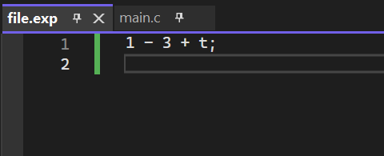

# Compiler Design Project

A multi-phase compiler front-end implementation in C, built step-by-step to understand compiler concepts from basic postfix parsing to code generation.

---

## Overview

This project simulates the front-end of a basic compiler through multiple phases. Each phase builds on the previous one, adding new functionality as the compiler develops.

---

## Project Structure

The project consists of four main phases:

### Phase 1 – Postfix Expression to Intermediate Language
- Parses postfix expressions
- Converts them to a simple Intermediate Language (IL)
- Each file is standalone with its own `main()` function

### Phase 2 – Input Handling
- Adds support for number recognition
- Handles whitespace ignoring
- Also uses independent `main()` files

### Phase 3 – Core Compiler Logic
- Introduces lexical analysis, parsing, and semantic checks
- Includes symbol table handling
- Has a centralized `main.c` file to drive the compilation process
- Generates object code files (`.obj`) and error logs (`.err`, `.exp`)

### Phase 4 – Code Generation
- **Phase 4a**: Basic code generation output
- **Phase 4b**: Improved version with optimizations
- Both phases include full compiler flow and output files for testing

---

## Example Output

### Phase 3

**Input:**


**Output:**


### Phase 4b

**Input:**


**Output:**


---

## Built With

- **Language**: C
- **Platform**: Windows 11
- **IDE**: Microsoft Visual Studio

---

## How to Run

### For Phase 1 and 2:
Each file has its own `main()` function. To run a specific one:
1. Open the file in Visual Studio
2. Make sure only that file's `main()` is active
3. Comment out other `main()` functions
4. Build and run

### For Phase 3 and 4:
1. Open the project in Visual Studio
2. Make sure `main.c` is set as the entry point
3. Build the project
4. Run the output
5. Input can be provided via file or manually

---

## Folder Structure

```
CompilerDesign_Project/
├── phase1_postfix_IL/
├── phase2_input_handling/
├── phase3_compiler_core/
├── phase4a_codegen_basic/
├── phase4b_codegen_optimized/
└── images/
```

---

## License

This project is open source and available for educational purposes.

---

## 👤 Author

**Sana Aledilbi**  
[GitHub Profile](https://github.com/SanaAledilbi)
